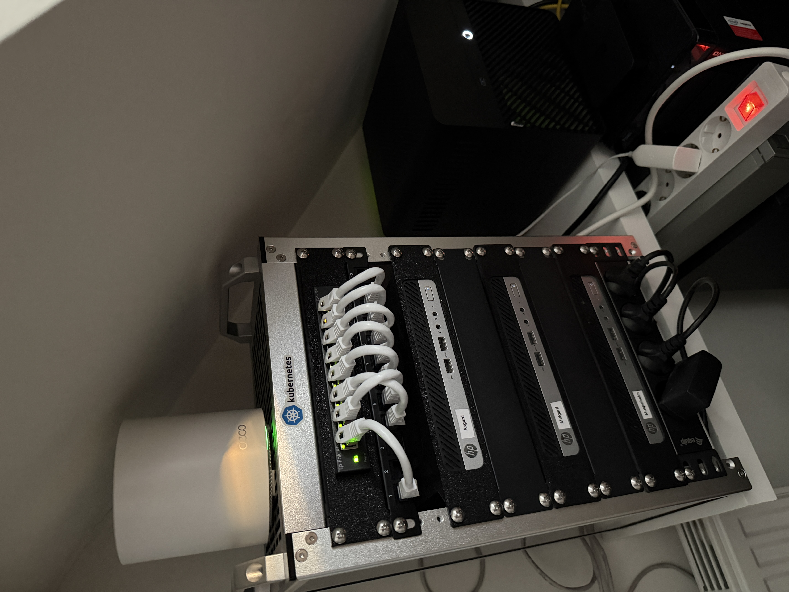

# sluxcloud homelab


A GitOps-managed homelab running on a 3-node [Talos](https://www.talos.dev/) Kubernetes cluster (`sluxcloud`), reconciled continuously by [Flux](https://fluxcd.io/). Every change merged to `main` is applied to the cluster automatically. So no manual `kubectl apply` is needed.



## Stack

| Layer | Technology |
|---|---|
| OS | [Talos Linux](https://www.talos.dev/) — immutable, API-managed Kubernetes OS |
| GitOps | [Flux](https://fluxcd.io/) |
| CNI | [Cilium](https://cilium.io/), with BGP for advertising LoadBalancer IPs |
| Ingress | [Envoy Gateway](https://gateway.envoyproxy.io/) (Kubernetes Gateway API) — an `internal` gateway (LAN-only) and an `external` gateway (via Cloudflare Tunnel), TLS via cert-manager + Let's Encrypt |
| DNS | Split DNS via ExternalDNS: the same domain resolves differently depending on where you are — Unifi (internal DNS) answers with the `internal` Gateway's LAN IP for on-network/VPN clients, while Cloudflare (external DNS) answers with the `external` Gateway's Cloudflare Tunnel address for everyone else |
| Secrets | [SOPS](https://github.com/getsops/sops) + age for secrets committed to the repo, [1Password](https://1password.com/) + External Secrets Operator for everything injected at runtime — no plaintext secrets ever touch git |
| Storage | NFS-backed persistent volumes via `csi-driver-nfs` |
| Network Policy | Deny-by-default via CiliumNetworkPolicy. A clusterwide baseline blocks egress to home/storage VLANs while allowing pod-to-pod and internet traffic; specific destinations and ingress sources are re-opened per-workload through reusable label-based policies (`networkpolicy.sluxcloud/...`), so an app only gets the exact access it declares |
| Observability | kube-prometheus-stack (Prometheus/Grafana/Alertmanager) + Loki/Promtail |

## Cluster

| Node | Hostname | Role |
|---|---|---|
| 1 | `asgard` | control-plane + worker |
| 2 | `midgard` | control-plane + worker |
| 3 | `muspelheim` | control-plane + worker |

## Apps

Self-hosted applications deployed on top of the platform layer above:

| Category | Apps |
|---|---|
| Files & Sync | Immich, Syncthing, Filebrowser, Radicale |
| Automation | Home Assistant, ESPHome, n8n |
| Identity & Auth | Pocket ID, Tinyauth, 1Password Connect |

## Repository Layout

```
kubernetes/
  clusters/homelab/     # Flux entry point: root Kustomizations (configs -> apps)
  configs/               # Cluster-wide config (SOPS-encrypted), substituted into every app
  apps/<namespace>/      # One directory per app, each a self-contained Flux Kustomization
  components/            # Shared chart sources (e.g. bjw-s/app-template)
talos/
  patches/               # Per-node and cluster-wide Talos machine config patches
scripts/cluster-lifecycle/  # Bootstrap and config-generation tooling
```

Flux syncs in two stages: `configs` applies the cluster-wide ConfigMap first, then `apps` deploys every application, substituting in the values from that ConfigMap. Every Helm release picks up sane defaults (CRD upgrades, retries, automatic rollback) from a single patch, so individual apps don't need to repeat that boilerplate.

## Adding an app

Each app lives in its own `kubernetes/apps/<namespace>/<appname>/` directory with a Flux `Kustomization` (`ks.yaml`) pointing at an `app/` folder containing the Helm source (`ocirepository.yaml`) and values (`helmrelease.yaml`). Most apps are built on [bjw-s/app-template](https://bjw-s-labs.github.io/helm-charts/docs/app-template/), which keeps each app's manifests small and consistent. Network access between namespaces is deny-by-default via CiliumNetworkPolicy, so new apps must explicitly opt in to the traffic they need.

## Getting Started

1. Provision a Talos cluster (`scripts/cluster-lifecycle/generate-talos-configs.sh`, then `bootstrap-cluster.sh`)
2. Install Cilium as the CNI
3. Create the `sops-age` secret in the `flux-system` namespace so Flux can decrypt SOPS-encrypted manifests
4. Bootstrap Flux and point it at this repository

From there, Flux takes over — every change merged to `main` is reconciled onto the cluster automatically.

## License

[MIT](LICENSE)
